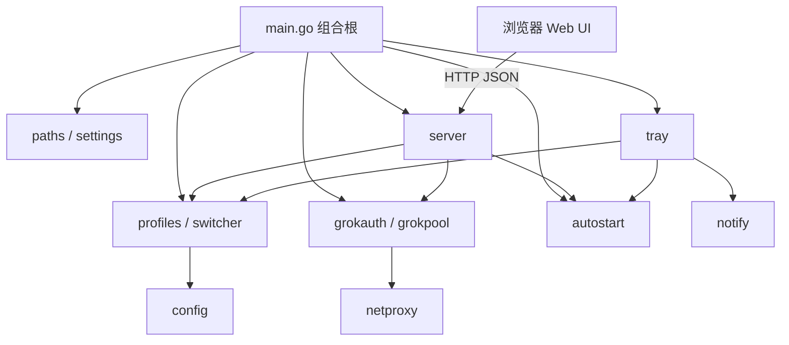

# 项目概览

## 初步方向

在保留现有 Grok 配置切换、账号池、本地代理和 Web 管理能力的前提下，将当前以 Windows 为主要交付目标的 Go 托盘程序适配为可在 macOS 上安装、运行和登录时启动的菜单栏应用。

## 当前架构

程序采用“本地 HTTP 服务 + 浏览器 Web UI + 系统托盘/菜单栏”的桌面架构。`main.go` 负责解析启动参数、创建各存储与管理器、启动仅监听 `127.0.0.1` 的服务，并把状态变化回调连接到托盘刷新。前端作为静态资源嵌入二进制，不依赖 Node 运行时。

核心业务代码大多已经使用 `os`、`filepath`、标准 HTTP 客户端和用户主目录，天然可在 macOS 运行。现有平台缺口主要位于系统集成和分发层，而不是配置切换与账号池核心。

## 技术栈

| 层级 | 当前实现 | macOS 目标 |
|:---|:---|:---|
| 语言 | Go 1.26 | 保持 Go 1.26 |
| 桌面外壳 | `fyne.io/systray` | 保持菜单栏模式，补 macOS 图标资源 |
| 管理界面 | 原生 HTML/CSS/JavaScript | 保持浏览器 Web UI |
| 本地服务 | `net/http`，仅监听 `127.0.0.1` | 保持不变 |
| 配置格式 | TOML、JSON | 保持不变，兼容现有 `~/.grok_switch` 数据 |
| 系统自启动 | Windows 注册表 | macOS LaunchAgent |
| 构建产物 | `grok_switch.exe` | `Grok Build Switch.app`，可选 DMG |
| 发布自动化 | 仅有文档站 Pages 工作流 | 增加 macOS 构建/发布流程 |

## 入口

- `main.go`：桌面程序唯一入口，支持 `--silent` 与 `--no-tray`。
- `internal/server.Server.Listen`：本地 HTTP 服务入口，注册 22 个路由。
- `internal/tray.Tray.Run`：菜单栏入口，负责快速切换、打开面板、自启动和退出。
- `ui/index.html` + `ui/app.js`：Web 管理界面入口。
- `build.ps1`：现有 Windows 构建入口。

## 当前构建与运行

- 仓库声明 `go 1.26`，依赖 `fyne.io/systray`、`go-toml/v2` 和 `x/sys`。
- Windows 使用 `build.ps1` 运行 `go test ./...`，生成 ICO/资源后以 GUI 子系统构建 EXE。
- macOS 没有构建脚本、`.app` 目录结构、`Info.plist`、ICNS 资源、签名或 DMG 流程。
- 当前分析主机为 Apple Silicon (`arm64`) 和 macOS 26.5.1，已安装 Xcode Command Line Tools，但未安装 `go`，因此本轮无法建立真实编译基线。

## 测试基线

已有 Go 测试覆盖配置 TOML 重写、Profile 存储、Grok Auth、账号池、代理解析和部分 HTTP handler。测试主要保护跨平台核心逻辑。

以下与本次适配直接相关的区域缺少测试：

- `internal/autostart` 没有任何测试。
- `internal/tray`、`internal/notify`、`internal/paths`、`internal/settings` 没有测试。
- 没有 macOS `.app` 结构、`Info.plist`、图标和启动参数的打包验证。
- 当前环境没有 Go 工具链，无法执行现有测试或构建；实施阶段必须先解决工具链前置条件或使用 GitHub Actions 验证。

## 项目治理基线

- 仓库内原先没有 `AGENTS.md`、`CLAUDE.md`、平台规则目录或 `docs/progress/MASTER.md`。
- 当前会话提供了始终生效的项目指令，并要求使用 CodeGraph；已在 `.codegraph/` 初始化 31 个文件、708 个节点和 2509 条边的索引。
- 没有已声明的仓库内持久记忆文件；本次不新建竞争性的记忆源。
- 规范驱动任务跟踪模式为 `LOCAL_ONLY`：个人 fork 已创建，但 fork 关闭 Issues，当前 GitHub 令牌也缺少 Projects 读取权限。

## 外部集成

- Grok CLI：读取 `~/.grok/config.toml` 与 `~/.grok/auth.json`，必要时执行 `grok login`。
- xAI OAuth/API：刷新凭据、探测账号健康度并转发本地代理请求。
- 系统能力：浏览器、文件管理器、剪贴板、桌面通知、登录时启动。
- 文件系统：默认把兼容数据保存在 `~/.grok_switch`，敏感凭据文件在非 Windows 平台使用 `0600` 权限。

## Fork 状态

- 上游：`1parado/grok-build-switch`
- 个人 fork：`xingranya/grok-build-switch`
- 基线提交：`5a3dbd0`
- 当前沙箱把 `.git/config` 设为只读，`gh repo fork` 已完成远端 fork，但无法自动把本地 `origin` 重命名为 `upstream`。
