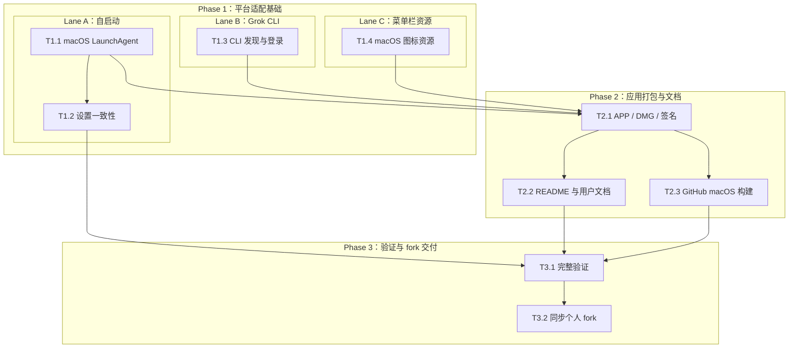

# 任务依赖图

```mermaid
graph TD
    subgraph P1[Phase 1：平台适配基础]
        subgraph L1A[Lane A：自启动]
            T11[T1.1 macOS LaunchAgent]
            T12[T1.2 设置一致性]
            T11 --> T12
        end
        subgraph L1B[Lane B：Grok CLI]
            T13[T1.3 CLI 发现与登录]
        end
        subgraph L1C[Lane C：菜单栏资源]
            T14[T1.4 macOS 图标资源]
        end
    end

    subgraph P2[Phase 2：应用打包与文档]
        T21[T2.1 APP / DMG / 签名]
        T22[T2.2 README 与用户文档]
        T23[T2.3 GitHub macOS 构建]
        T21 --> T22
        T21 --> T23
    end

    subgraph P3[Phase 3：验证与 fork 交付]
        T31[T3.1 完整验证]
        T32[T3.2 同步个人 fork]
        T31 --> T32
    end

    T11 --> T21
    T13 --> T21
    T14 --> T21
    T12 --> T31
    T22 --> T31
    T23 --> T31
```
